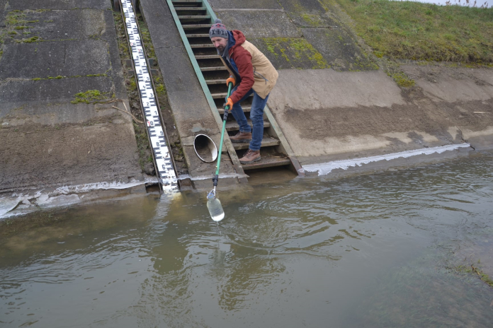

<b>Dr. Patziger Miklós:</b> A BME Vízi Közmű és Környezetmérnöki Tanszék egyetemi docense, tanszékvezető. <a href="https://epito.bme.hu/patziger-miklos" target="_blank">https://epito.bme.hu/patziger-miklos</a>
  
<b>Murányi Gábor</b> A BME Vízi Közmű és Környezetmérnöki Tanszék harmadéves doktorandusz hallgatója. Kutatási témája alternatív árvízvédelmi megoldások stratégiai lehetőségeinek tudományos megalapozása.  <a href="http://vkkt.bme.hu/muranyi-gabor" target="_blank">http://vkkt.bme.hu/muranyi-gabor</a>
  
A víz a Földön körülvesz minket. Még a csapból is ez folyik. De hogyan került oda? Ha szívesen hallanál vízkezelési technológiákról, a víz útjáról, vagy csak belepillantanál a mikroszkópba, hogy lásd a láthatatlant, várunk! 
  

