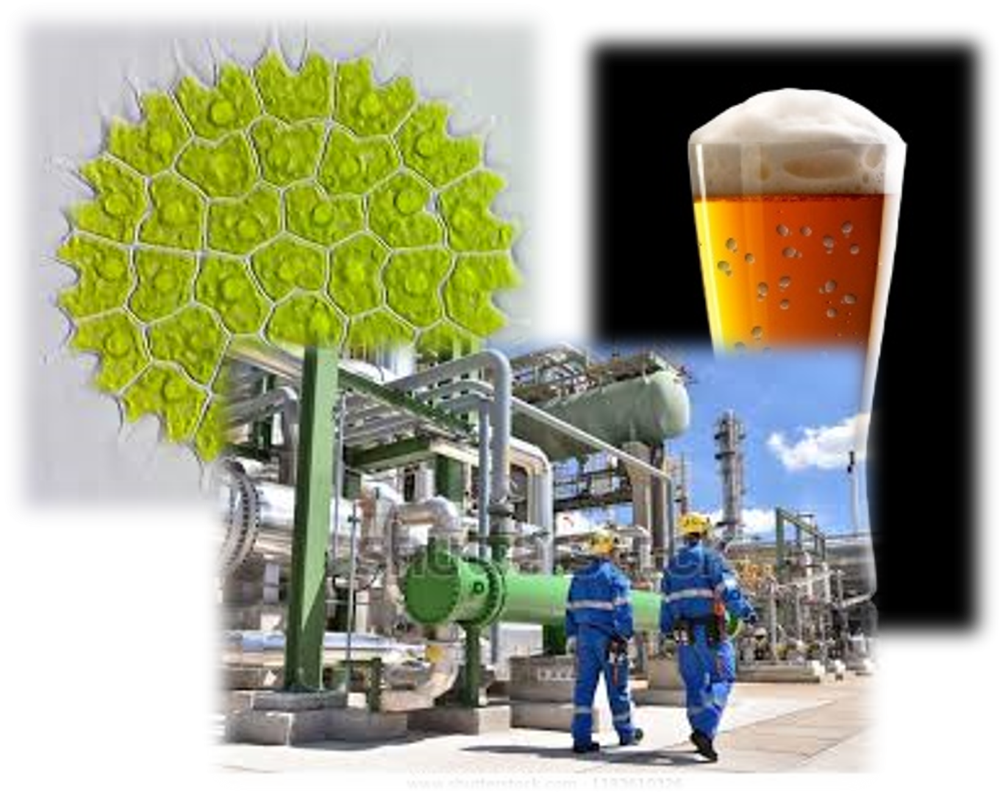

<b>Dr. Németh Áron:</b> egyetemi docens, munkáját a jogelőd Mezőgazdasági Kémiai Technológia Tanszéken kezdte. 2002-ben végzett biomérnökként Alkalmazott Biotechnológia Szakirányon, majd 2008-ban szerzett PhD fokozatot summa cum laude minősítéssel. Enzimes és mikrobiális technológiák fejlesztése, modellezése és léptéknövelése a fő kutatási és oktatási területe. 7 éve vezeti a Fermentációs Félüzemi Kutató csoportot.
   
<b>Tóth Pál:</b> doktoráns, Tanulmányait a Budapest Műszaki és Gazdasági Tudomány Egyetemen a Vegyész és Biomérnök Karán MSc gyógyszervegyész-mérnökként 2019ben fejezte be. Jelenleg a BME VBK ABÉT tanszéken folytatja doktori tanulmányait kozmetikai és étrendkiegészítő komponensek fermentációs előállításának vizsgálata címmel.
  
A látogatás során bemutatjuk, hogy az alaptudományok (kémia, biokémia, biológia) folymatai és jelenségei hogyan befolyásolják a termelő biotechnológiai folyamatokat. Milyen szabályozástechnikai trükkökkel lehet például rávenni a hétköznapi élesztőt, hogy alkohol helyett biomasszát termeljen vagy egy algát, hogy a napfény helyett ecetet egyen.
A laborlátogatás 1 rövid előadásból és a Kísérleti üzem körbejárásából, valamint egy kísérleti üzemi fermentor kipróblásából (szabályzás, mintavétel, mikroszkópozás) áll 2 turnussal.
  
 

