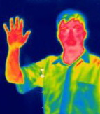

<b>Dr. Hlinka József:</b> A Budapesti Műszaki és Gazdaságtudományi Egyetem Közlekedésmérnöki és Járműmérnöki Karának Gépjárműtechnológia Tanszékén egyetemi adjunktusként dolgozik. Az egyetemen oktató és kutató munkát végez.
  
Bemutatásra kerülnek a korszerű diagnosztika területéről a nagysebességű- és hőkamerás vizsgálatok eszközei és példák alkalmazási lehetőségeikről. A hőkamerás vizsgálatok esetében a szemünk számára láthatatlan elektromágneses sugárzásokat vizsgáljuk.  
  
 

