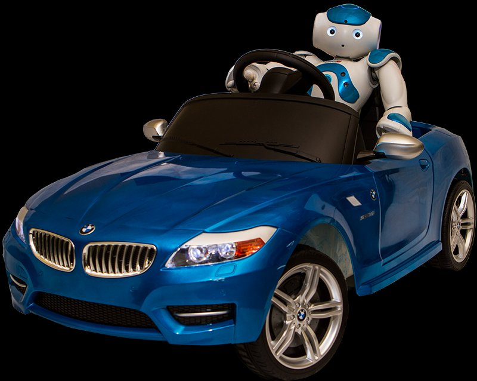

<b>Dr. Aradi Szilárd: </b> egyetemi docens egyetemi tanulmányait a BME Közlekedésmérnöki és Járműmérnöki Karán végezte. A BME Közlekedés- és Járműirányítási Tanszékén (volt Közlekedésautomatikai Tanszék) vett részt a doktori képzésben, ahol vasúti témakörben írta doktori disszertációját. Az elmúlt években oktatási és kutatási tevekénységeinek hangsúlya a járműmechatronikai területre helyeződött át. Ezen belül a járműfedélzeti vezérlőegységek vezetékes és vezetéknélküli kommunikációjával, valamint a járművek környezetérzékelésével kapcsolatos oktatási és kutatási feladatokat lát el. Az elmúlt években vett több eredményes - magyarországi járműipari fejlesztőközpontokkal közös- ipari együttműködésben vett részt.

<b>Fehér Árpád: </b> jelenleg a Kandó Kálmán Doktori Iskola harmadéves hallgatója. Tanulmányait 2010 szeptemberében kezdte a BME Közlekedésmérnöki és Járműmérnöki Karán és 2012 óta aktív tagja és munkatársa a BME Közlekedés- és Járműirányítási Tanszéknek (volt Közlekedésautomatikai Tanszék), ahol jelenleg a doktori tanulmányait is végzi. Fő kutatási területe az autonóm járművekkel kapcsolatos gépi tanuló algoritmusok tervezése. Az elmúlt években számos ipari és demonstrációs munkában végzett fejlesztési tevékenységet valós járműveken tesztpályás környezetben. Ezeknél lehetősége volt integrálni az egyetemi tanulmányai alatt megszerzett járműmechatronikai ismereteit a mesterséges intelligencia alapú kutatási témáival. 2013 óta foglalkozik járműfedélzeti vezérlőegységek nyomtatott áramköreinek tervezésével és azok programozásával, amit azóta is rendszeresen oktat. Oktatóként jelentős figyelmet fordít a hallgatók projektfeladatokban végzett tevékenységére, melyek során számos sikeres TDK munkánál és szakdolgozatnál vállalt konzulensi szerepet.

A látogatók láthatják a járműmérnök hallgatók által épített elektromos, önvezető gokartot, mellyel egy automatizált „valet parking” funkció kerül bemutatásra. Emellett kötetlen beszélgetést folytathatnak szakértőinkkel az önvezető járművek fejlesztéséről.

 

