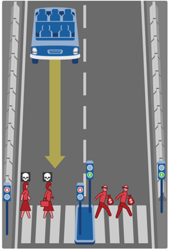

<b>Dr. Németh Balázs: </b>A BME Közlekedés- és Járműirányítási Tanszékének címzetes egyetemi docense, oktatási és kutatási területe az önvezető járművek irányítórendszereinek tervezési kérdései. Mérnöki-kutatói hivatása mellett egyben református lelkész. Személyes motivációja a terület kapcsán választ találni a kérdésekre, hogyan lehet képes egy önvezető algoritmus figyelembe venni hatékonyan a közlekedési rendszer minden emberi szereplőjét, milyen megbízhatósági garanciákat képesek nyújtani a gépi tanulásra épülő algoritmusok, valamint hogyan lehetséges etikai szempontokat beépíteni az önvezető járműrendszerek döntéshozási folyamataiba.

A járművek automatizálása, különösen is a jövő egyik nagy reménysége, az önvezető autók számos etikai kérdést vetnek fel. Ezek közül a legismertebb az önvezető autó „önálló” döntése baleseti helyzet esetén, de a munkaerőpiaci átrendeződés, a mobilitási folyamatok változása, a katonai alkalmazások, illetve az ember elidegenedése az általa használt járműtől további kérdéseket vet fel. Az előadás célja egyes etikai kérdések felvázolása, a probléma összetettségének bemutatása, az etikai kérdések megvilágítása bibliai analógiákkal.

 

