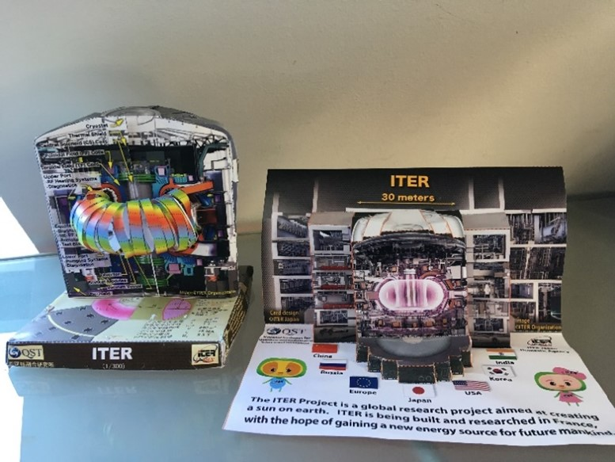

<b>Dr. Pokol Gergő:</b> egyetemi docens, a BME Fúziós Plazmafizika Csoport vezetője, a tokamakok nagy barátja.
  
A magfúzió jelensége a kiapadhatatlan, tiszta energiaforrás ígéretét hordozza. A folyamat hasznosításához szükséges extrém körülményeket tokamak berendezésekben tudjuk létrehozni. Tokamakot építeni pedig egyszerű: papírból már 4 éves kortól meg lehet próbálni! Idősebbek próbálkozhatnak a japán origami tokamakkal is. Munka közben pedig megtanuljuk, hogy miért néz úgy ki a tokamak, ahogy kinéz, és hogyan működik. 
  
 

