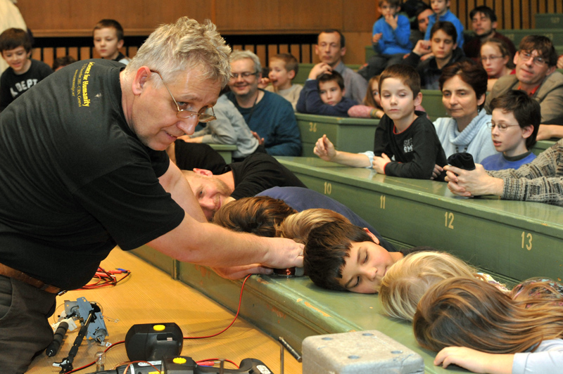

<b>Härtlein Károly: </b>Műegyetem Fizikai Intézet mesteroktatója,  <a href="http://goliat.eik.bme.hu/~hartlein/" target="_blank" > http://goliat.eik.bme.hu/~ </a>
  
A fizika legszerethetőbb részének, a kísérletezésnek szenteljük ezt a délutánt. Intézetünkben bemutatható kísérletekből válogatok, megmutatva, hogy a fizika mennyire szövi át a mindennapjainkat - ezért fontos a fizika tudása-tanulása.
  

