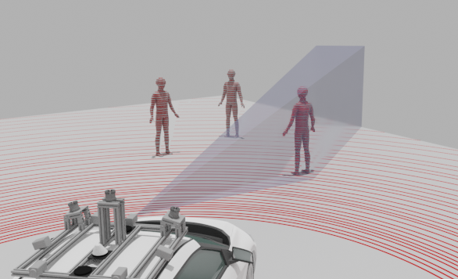

<b>Dr. Rövid András:</b> tudományos főmunkatárs
A Budapesti Műszaki és Gazdaságtudományi Egyetem, Közlekedésmérnöki és Járműmérnöki Kar, Gépjárműtechnológia Tanszék  
A Környezetérzékelés kutatócsoport vezetője.  
Tématerület: gépi látás, képfeldogozás, nyers szenzor fúzió
  
<b>Vincze Zsolt:</b> A Budapesti Műszaki és Gazdaságtudományi Egyetem, Közlekedésmérnöki és Járműmérnöki Kar, Gépjárműtechnológia Tanszék
tudományos segédmunkatárs, PhD hallgató.  
Tématerület: Szenzor szinergiákon alapuló intelligens környezetérzékelési módszerek az autonóm közlekedés támogatására 
Kutatócsoport: Környezetérzékelés
  
<b>Cserni Márton:</b> tudományos főmunkatárs
A Budapesti Műszaki és Gazdaságtudományi Egyetem, Közlekedésmérnöki és Járműmérnöki Kar, Gépjárműtechnológia Tanszék
MSc hallgató 
Tématerület: Monokamera alapú 3D objektumdetekció 
Kutatócsoport: Környezetérzékelés
  
A látogatók megszemlélhetik hogyan működik egy több szenzorállomást tartalmazó központi érzékelő rendszer, mely a detektált objektumokat kiterjesztett valóság segítségével vizualizálja.   
  
 

