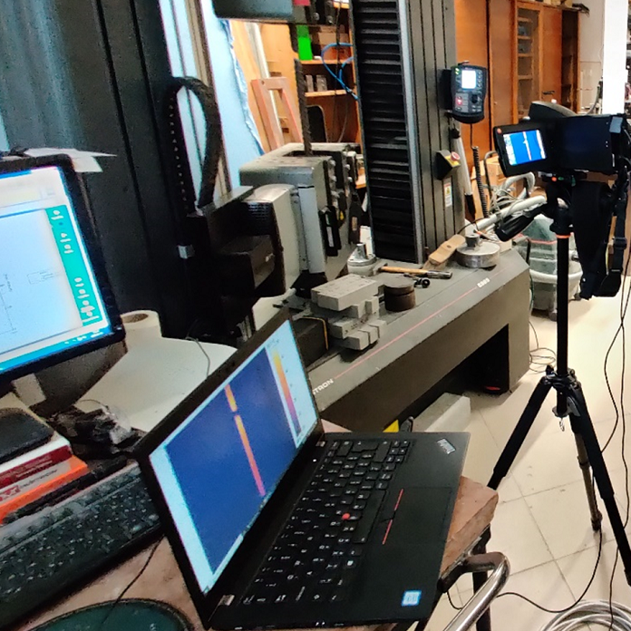

<b>Dr. Nehme Salem:</b> Tanszékvezető, egyetemi docens, <a href="https://epito.bme.hu/salem-nehme" target="_blank">https://epito.bme.hu/salem-nehme</a>
  
<b>Csanády Dániel:</b> Doktorjelölt, fő kutatási területe a természetes alapanyagú hőszigetelések fejlesztése. <a href="http://em.bme.hu/csanady-daniel" target="_blank">http://em.bme.hu/csanady-daniel</a>
  
<b>Dr. Nagy Balázs</b> Adjunktus, minőségirányítási vezető, fő kutatási területe az építő- és hőszigetelőanyagok, valamint az épületszerkezetek épületfizikai vizsgálata, <a href="http://em.bme.hu/nagy-balazs" target="_blank">http://em.bme.hu/nagy-balazs</a>
  
<b>Dr. Sólyom Sándor:</b> Adjunktus, fő kutatási területe a szálerősítésű polimer betétek alkalmazása betonszerkezetekhez, <a href="http://em.bme.hu/solyom-sandor" target="_blank">http://em.bme.hu/solyom-sandor</a>
  
<b>Szijártó Anna:</b> Doktorandusz, fő kutatási területe a betontechnológia és betonszerkezetek vizsgálata,    <a href="http://em.bme.hu/szijarto-anna" target="_blank">http://em.bme.hu/szijarto-anna</a>
  
Ezen az estén az érdeklődő középiskolások és egyetemisták, valamint felnőttek betekintést nyerhetnek a BME Építőmérnöki Kar Anyagvizsgáló Laboratóriumának mindennapi működésébe, valamint legújabb kutatásainkba. A laborlátogatás során munkatársaink érdekes kísérletekkel demonstrálják a szerkezeti anyagok (pl. acél és beton), valamint a természetes és mesterséges hőszigetelőanyagok (pl. szalma vagy polisztirolhab) viselkedését tartószerkezeti, tűzállósági és hőtechnikai szempontokból. A demonstrációk soránszakad az acél, reped a beton, valamint a hőszigetelőanyagainkat is komoly igénybevételeknek fogjuk kitenni, mely kísérletek során nagyerejű elektro-mechanikus szakító és törőgépek valamint termovíziós kamerák is segítségünkre lesznek.
  

