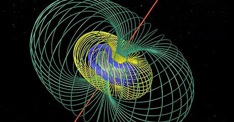

<b>Pintér Gergő:</b> matematikus, jelenleg a BME Fizika Intézet kutatója. A MateMorfózis előadássorozat keretében szórakoztató fesztiválműfajt formált a “felsőbb” matematikából, amely könnyed, de súlyos. A gyakran merevnek, száraznak vélt matematika világának szabadságát és teremtőerejét mutatja be, mely sok szálon szoros összefüggésben van az életünkkel, világszemléletünkkel, ily módon mindennapjainkra is hat. Új világok teremtése című ismeretterjesztő könyve egy éve jelent meg a Typotex Kiadónál.
  
A kvantumszámítógépek számítási alapegységei a kvantumbitek. Egy kvantumbit állapotait négy dimenziós térben ábrázolhatjuk. Ezt közvetlenül elképzelni ugyan nem tudjuk, mégis szemléletessé tehetjük a Hopf-fibrálás segítségével - és elkápráztató képet kapunk.
  

