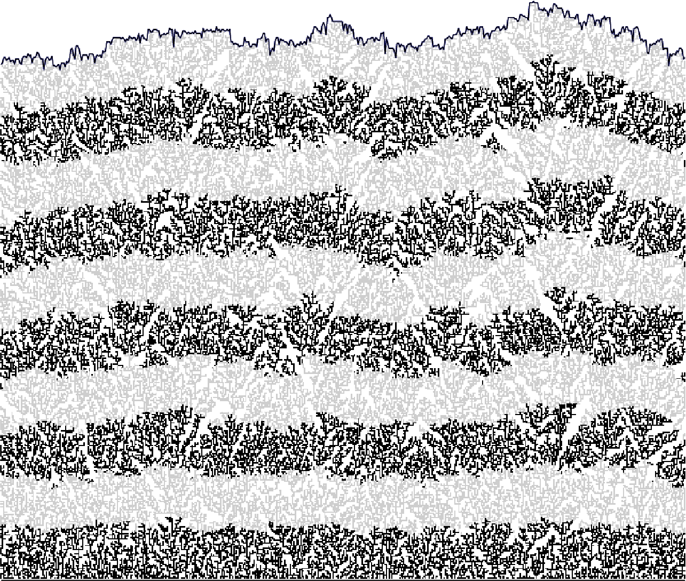

<b><a href="https://math.bme.hu/~vetob/" target="_blank">Vető Bálint</a>:</b> BME Matematika Intézet, egyetemi docens
  
Mi a közös a természetben előforduló véletlen felületnövekedési folyamatokban? Ezen jelenségeket matematikai modellek segítségével írjuk le. Az előadáson a modellek ismertetése mellett kísérleti és szimulációs eredményeket mutatunk be.     
  

