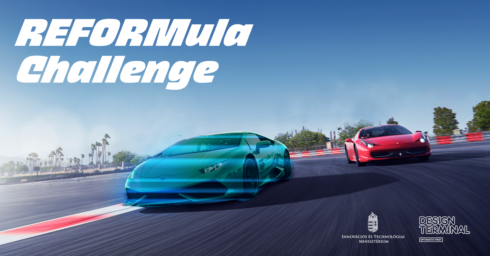

<b>Dr. Németh Balázs: </b>A BME Közlekedés- és Járműirányítási Tanszékének címzetes egyetemi docense, oktatási és kutatási területe az önvezető járművek irányítórendszereinek tervezési kérdései. Mérnöki-kutatói hivatása mellett egyben református lelkész. Személyes motivációja a terület kapcsán választ találni a kérdésekre, hogyan lehet képes egy önvezető algoritmus figyelembe venni hatékonyan a közlekedési rendszer minden emberi szereplőjét, milyen megbízhatósági garanciákat képesek nyújtani a gépi tanulásra épülő algoritmusok, valamint hogyan lehetséges etikai szempontokat beépíteni az önvezető járműrendszerek döntéshozási folyamataiba.

A program résztvevői távirányítós RC kisautókkal versenyezhetnek egymással és virtuális önvezető járművekkel. A verseny technikai hátterét egy kamerarendszer és egy kiterjesztett valóság mobil applikáció biztosítja, aminek segítségével a résztvevők a virtuális járműveket láthatják a pályán. A program folyamatos, a résztvevők érkezési sorrendben vehetnek részt a versenyben, amikor szabad a pálya, illetve rendelkezésre áll feltöltött akkumulátor.

 

