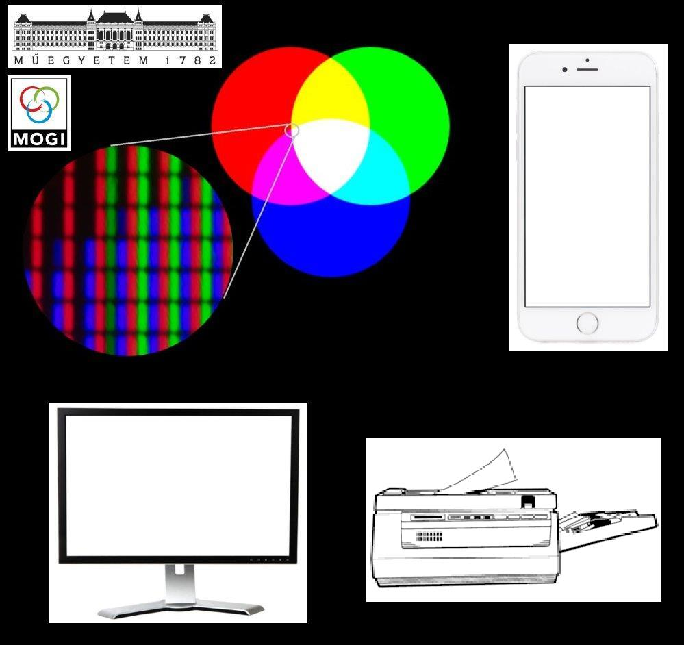

Színek keverésének bemutatása elektronikus megjelenítőkön - azaz hogyan működik a mobiltelefon, TV és projektor színmegjelenítése.

<b>Dr. Samu Krisztián: </b> BME, Mechatronika, Optika és Gépészeti Informatika Tsz., egyetemi docens

Kutatási területe: elektronikus képmegjelenítők színtani tulajdonságai, színméréstechnika, megjelenítők színtévesztésdiagnostikai felhasználása.

<b>Samu Sára: </b>II. Rákóczi Ferenc Gimnázium, Budapest, 10. osztály

Öntevékeny diák kutatási tevékenység: színtévesztés diagnosztika és korrekció népszerűsétése (Orchidea Science Award, 1. helyezés)  

