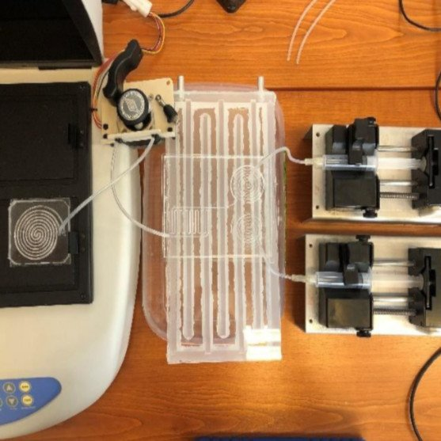

<b>Borók Alexandra</b>: Az Elektronikai Technológia Tanszék PhD hallgatója, plazmonikus nanokompozitok fejlesztésével foglalkozik. Gépészmérnöki BSc végzettségét 2016-ban szerezte, egészségügyi mérnöki MSc diplomáját pedig 2020-ban. Kutatási témái besorolhatók az anyagtudomány, a mikrofluidika és a plazmonika tudományterületeibe.
  
<b>Kovács Rebeka</b>: Elektronikai Technológia Tanszék PhD hallgatója. Biomérnöki BSc és Egészségügyi mérnöki MSc végzettséggel rendelkezik. Doktori kutatásának témája a lokalizált felületi plazmonrezonancián alapuló bioszenzor fejlesztése.

Hogyan kapcsolódik a biológiai minták vizsgálata a villamosmérnöki és gépészeti tudományokhoz? Mik a mikrovilág törvényszerűségei? Ezekre és még sok érdekes kérdésre kaphatnak választ a résztvevők. A mikrofluidikai rendszereket elterjedten alkalmazzák az orvosi, biológiai és kémiai kutatások területén, mert segítségükkel hordozható, kis méretű diagnosztikai eszközöket kaphatunk. A mikrofluidikai eszközök hagyományos gyártási technológiáival szemben a 3D nyomtatást kis anyagköltség, rövid gyártási idő és széleskörű alapanyag használat jellemzi. Alkalmazásával lehetőség nyílik komplex csatorna-rendszerek megvalósítására, akár háromdimenzióban is. A laborlátogatás során bemutatjuk hogy mi is a mikrofluidika, hogyan alkalmazzuk az additív gyártást a mikrofluidikai eszközök kialakítására, és megmutatunk néhány alkalmazási példát is.

  

