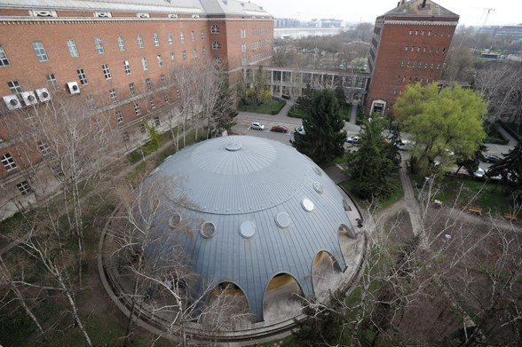

<a href="http://www.reak.bme.hu/munkatars/oktatok/zsiros-gabor.html" target="_blank"> Zsíros Gábor</a> 

A BME Nukleáris Technikai Intézet Oktatóreaktorának megtekintése. Rövid, kb. fél órás előadás ismerteti a reaktor működésének fizikai alapjait. Ezután megmutatjuk a reaktorépület egyes részeit, működési funkcióit.

<b>A belépés feltétele a betöltött 16 év!</b>

 