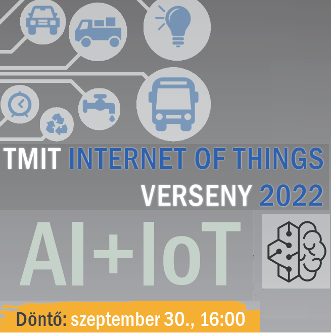

<a href="https://www.tmit.bme.hu/iot-verseny" target="_blank">Dr. Varga Pál</a>

<b>A döntőbe jutott pályaművek</b>: 
Hydrobot - autonóm csőrendszer monitorozó eszköz 
Gépjárműsérülés-felismerő rendszer 
Növénygondozó cserép 
MobMod - járműtelítettség-mérő rendszer 
AI-támogatású egészségügyi elosztó 
Non-invazív egészségügyi mérőeszköz IoT alapokon

A TMIT AI+IoT verseny immár hetedik éve kerül megrendezésre.
A döntőbe jutott csapatok rövid előadásokban és demonstrációkban mutatják be innovációikat a Mesterséges Intelligencia és az IoT (Dolgok Internete) közös alkalmazásaiban.

  
