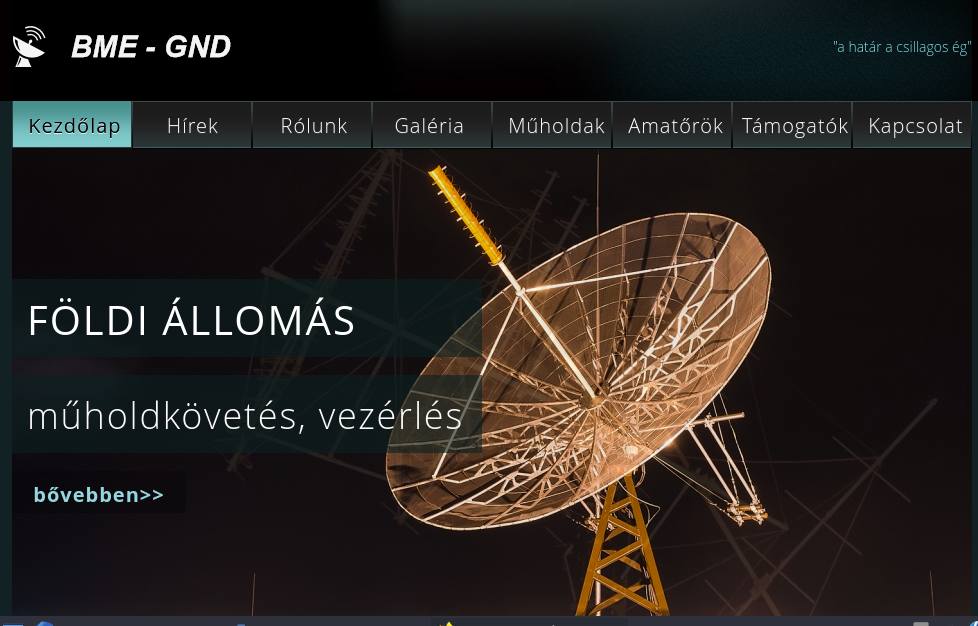

<b>Dudás Levente</b>: A Műegyetemi műhold projektek műszaki vezetője 

<b>Herman Tibor, Hödl Emil, Püspöki Péter, Szüllő Ádám</b>: A Műegyetemi műhold projektek aktív résztvevői, akik a műholdak egyes részegységeit tervezték, készítették. 

Egyszerre max. 12 fős csoportokban 1-1 órás bontásban a résztvevőknek lehetősége lesz megtekinteni a Műegyetem automatizált és távvezérelt földi állomását: E épület 12. szint. Az ismertetők során bemutatjuk a Műegyetem eddigi műholdjait, mint Masat-1, SMOG-P, ATL-1 és a jelenleg is üzemelő SMOG-1 kisműholdakat; a fejlesztéstől egészen a műholdak üzemeltetéséig illetve a mérési eredmények kiértékeléséig terjedően. 

  
