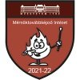

Az on-line oktatás elterjedésével megszoktuk, hogy a tartalmak és kommunikáció már főképp tartalomszolgáltató rendszereken keresztül jut el hozzánk. Legyen az Moodle, Teams, vagy Canvas, mindent az on-line felületen intézünk. A képzés végén azonban továbbra is a megszokott papír alapú tanúsítványokat, bizonyítványokat és diplomákat állítja ki az oktatási intézmény. Egyre nagyobb az igény, hogy a tanulás eredménye is egy szabványos digitális formátumban legyen eljuttatható annak megszezőjéhez. Az előadás a BME Mérnöktovábbképző kutatását, fejlesztését, és a megvalósuló Open Badge 2.0-ra épülő Displayer portálját mutatja be az érdeklődőknek.
  
<b>Zarka Dénes:</b> 1998 óta a Budapesti Műszaki és Gazdaságtudományi Egyetem Oktatásinnovációs és Felnőttképzési Központ főmunkatársa, tananyagfejlesztője.

  

