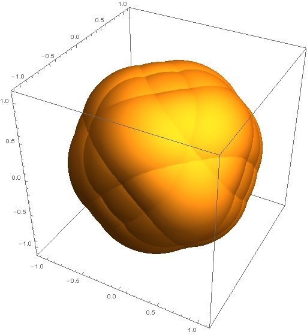

<b>Dr. Csima Géza</b>: a BME TTK Matematika Intézetének egyetemi adjunktusa. Kutatási területe a modern geometria.

Az előadásban röviden áttekintjük, milyen lehetőségek vannak a látószög és a híres Thalesz tétel általánosítására. A 3 dimenziós kiterjesztés komoly alkalmazási területekkel rendelkezik. Vizsgálódásunk során a matematika számos területét érintjük, nem csak a geometriát. Az előadásból az is kiderül, hogyan működik az alkalmazott matematika, milyen lépések vezetnek egy valós életből származó probléma megoldásához, valamint milyen lehetőségek vannak a mai kutatók előtt a matematikában. 

  

