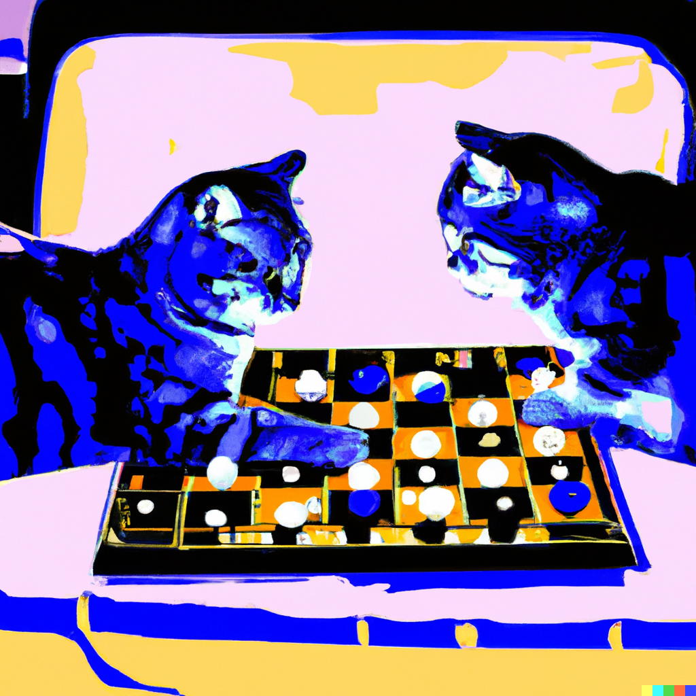

<b>Dr Rácz Péter</b>: a kognitív tudomány tanszék munkatársa, a nyelv és az agy viszonyával foglalkozik.

Hogyan tanulunk egymástól új szavakat? És régieket? Megváltozik-e a nyelvünk, amikor beszélgetünk egymással? Ezekre a kérdésekre kereshetik a választ a látogatók játékos formában, egy szócserélős játék keretein belül. 

  
