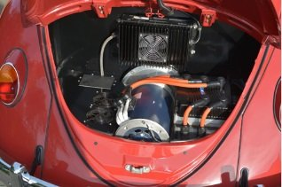

<b>Dr. Lovas László</b>: a BME Közlekedésmérnöki és Járműmérnöki Karán szerzett diplomát járműgépész szakirányon. PhD címét a gépjármű sebességváltók kapcsolhatósága témában szerezte. Jelenleg a BME Vasúti Járművek és Járműrendszeranalízis Tanszék docense. Több éve foglalkozik koponya implantátumok tervezésével.

Az elektromos hajtás erősen terjed az egyéni közlekedésben, a rollertől az autóig. Az előadásban szó esik a villanymotorokról, az energia tárolás, a hajtáslánc és a fűtés problémáiról, valamint a hatótávról.

  
