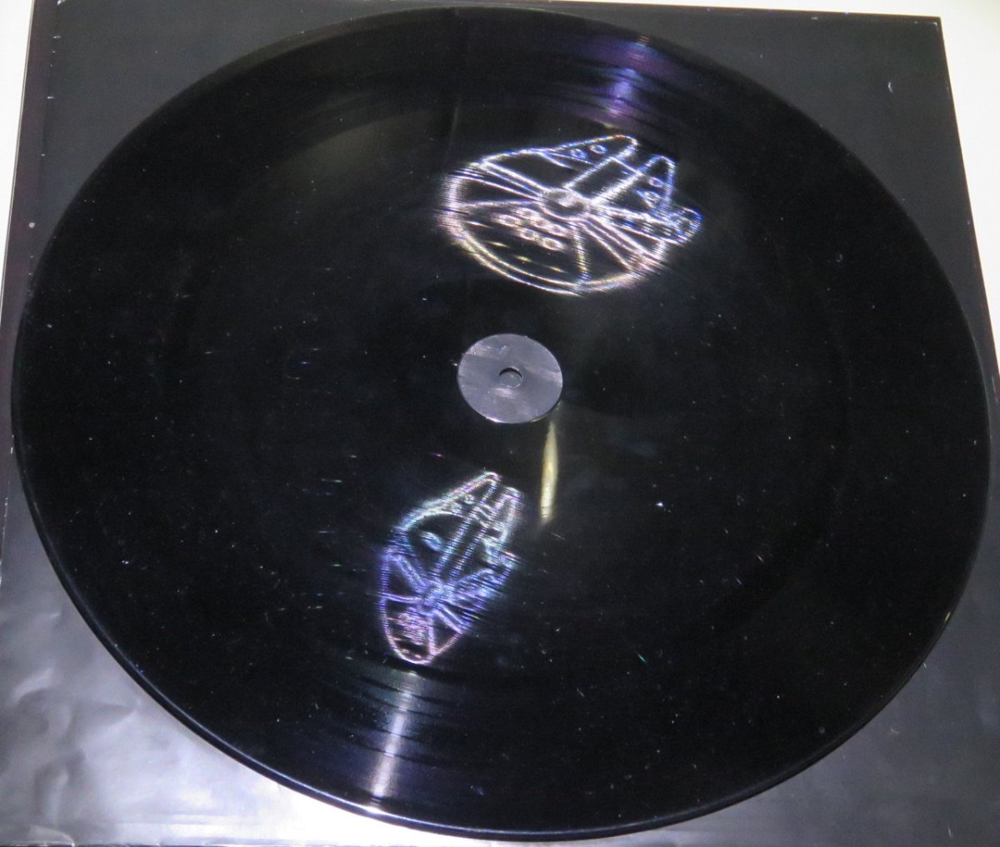

<b>Dr. Bokor Nándor</b>: a BME TTK Fizikai intézetének egyetemi docense. Kutatási területe a holográfia és alkalmazásai.

Az előadás az optika néhány látványos, a nagyközönség számára talán kevéssé ismert részterületéről szól: moiré-hatás, karcholográfia, varázstükrök, kausztikus leképezés, integrált fényképezés, fluoreszcencia, optikai aktivitás, száloptikai nagyítás. Az ábra egy ún. karchologrammot mutat.

  

