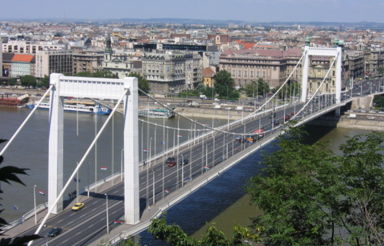

<a href=" https://hsz.bme.hu/farkas-gyorgy" target="_blank"> Dr. Farkas György</a>: A BME Hidak és Szerkezetek Tanszék professzor emeritusa
  
A hídlátogatás keretében a látogatóknak lehetőségük van bemenni az Erzsébet híd lehorgonyzó kamrájába. A látogatás során bemutatásra kerülnek a Duna-hidak jellemző szerkezeti rendszerei, különös tekintettel a függőhidak szerkezeti kialakítására és sajátosságaira. A program keretében fel lehet menni a híd alatt elhelyezkedő szerelőjárdára is, ahonnan a pályaszerkezet és annak részletei megtekinthetők.

 