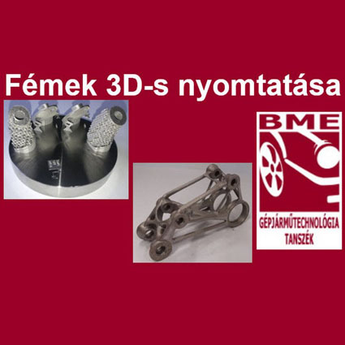

<b>Dr. Markovits Tamás</b>: A Budapesti Műszaki és Gazdaságtudományi Egyetem Közlekedésmérnöki és Járműmérnöki Karának Gépjárműtechnológia Tanszékének Tanszékvezető helyetteseként  dolgozik. Az egyetemen oktató és kutató munkát végez.

<b>Varga Ferenc László</b>: A Budapesti Műszaki és Gazdaságtudományi Egyetem Közlekedésmérnöki és Járműmérnöki Karának Gépjárműtechnológia Tanszékén doktorandusz hallgatóként dolgozik. Az egyetemen oktató és kutató munkát végez.

Egy korszerű megmunkálási eljárás kerül bemutatásra: porágyas lézersugaras fém nyomtatás, gyártás folyamata és nyomtatott modellek.

  
