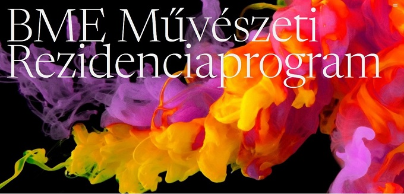

<a href="https://rezidensmuvesz.bme.hu/" target="_blank"> Rezidensművész</a>

Egyrészt interaktív alkotás a robotika segítségével Boruzs Ádám képzőművész, a BME rezidens művésze vezetésével. Ennek során a látogatók az emberi és gépi vizuális érzékelés összefüggéseiről és az alkotói szándék kapcsolatáról tudhatnak meg többet. Ezenfelül a színérzékelés folyamatát, működését és annak fizikáját is közelebb hozzuk a látogatókhoz. A robot megépítéséhez és programozásához a Lego Education Spike szoftvert, és a Lego Prime alkatrészeket használunk, aminek működésébe szintén bepillantást nyerhetnek az érdeklődők.
Másrészt az idő rögzítése és megfagyasztásában vehet részt a látogató Kocsi Olga képzőművész, BME rezidens interaktív installációjában. A Cascinai csata - Michelangelo egyik alkotásából indult gondolat hozta létre a projektet, ahol a kompozíción 19 férfi alak jelenik meg a csatatéren, de vizuálisan mégis inkább egy ember mozgásának tűnt. Egy mozdulat sornak az elkapott pillanatai terülnek szemünk elé.  Egy saját fejlesztésű szoftver VVVV környezetben és Micresoft Kinekt kamerából álló installációban a néző saját térben és időben létrejövő mozgását tudja szoborszerű kompozícióként megtekinteni. A látogatók saját idő-lenyomatokat tudnak létrehozni. 
A programokba folyamatosan be lehet kapcsolódni, de az eszközök és animátorok száma korlátozott.

  

