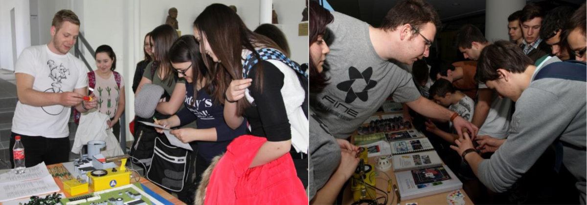

<a href="http://reak.bme.hu/munkatars/oktatok/orosz-gergely-imre.html" target="_blank"> Orosz Gergely</a>: BME doktorandusza, atomerőművek termohidraulikáját vizsgálgatja. Munkájában vagy 3D-s modelleket épít, vagy izgi lézeres kísérleteket csinál.

A FINE a Kutatók Éjszakáján minden érdeklődő korosztálynak igyekszik kielégíteni a kíváncsiságát. A jól ismert nukleáris tudományok tematikáját érintő kvízeink kitöltésért apróbb ajándékok nyerhetők. A kvízeket minden esetben közösen átbeszéljük, így senki sem szokott tőlünk megválaszolatlan kérdésekkel távozni.

A fiatalabb korosztályok körében a 3D- nyomtatott makettjeink igazán sikeresek. A makettek különböző atomerőművi blokkok konstrukcióját mutatják be. Az egyszerűsített makett összerakása közben játszva tanulhatják meg az erőmű működésének és biztonsági filozófiájának alapelveit.

A radioaktivitás szemléltetésére apróbb, de annál látványosabb kísérleteket fogunk bemutatni, mellyel közelebb hozható a laikusok számára is, ez a talán ijesztőnek ható tudományág.

  
