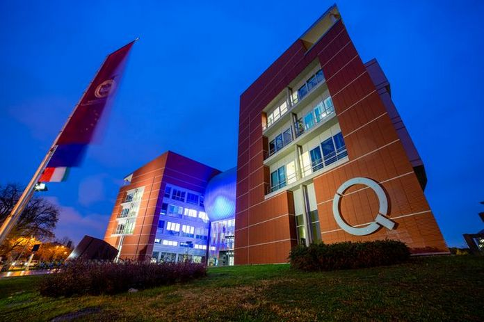

<a href="http://goliat.eik.bme.hu/~hartlein/" about:_blank> Härtlein Károly</a>: Műegyetem Fizikai Intézet mesteroktatója

 
A fizika alaptudomány, amely nélkül a modern társadalom összeomlik, ezért évről-évre várjuk a lelkes híveket, akik a fizika iránti szeretetükkel és tudásukkal tovább „fertőzhetik” a környezetüket. Idén nemcsak a fizika rejtelmeibe avatjuk be önöket, hanem zenélni is fogunk! Látszólag a zene és a fizika távol áll egymástól, de csak látszólag, hiszen a hangkeltés az egy tudomány. Minden nép – akár fejlett, modern társadalomban él, akár primitív, természeti nép – zenél, szórakoztatja magát. Fizikus szemmel vizsgálva a különböző népek zenéjében számtalan hasonlóság fedezhető fel. Mitől szép egy hang? Mitől „kedves” a fülünknek, ha egyszerre több hang szólal meg? Hogyan keletkezik a zenei hang? Ezeket a kérdéseket próbáljuk megválaszolni az előadás során. A megismerés módszerében nem térünk el hagyományainktól, vagyis sokat fogunk kísérletezni.

<b><i>Ez a különleges esemény a TTK és VIK közös rendezvénye!</i></b>
 
  
