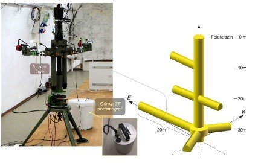

<a href="http://epito.bme.hu/volgyesi-lajos" about:_blank> Prof. Dr. Völgyesi Lajos</a>: geofizikus, akadémikus 
<a href="http://epito.bme.hu/toth-gyula" about:_blank> Dr. Tóth Gyula</a>: egyetemi docens 
<a href="https://wigner.hu/infopages/van.peter" about:_blank> Dr. Ván Péter</a>: tudományos tanácsadó 
<a href="https://www.facebook.com/ettesust/" about:_blank> Szondy György</a>: független kutató

Előadás az Eötvös-inga történetéről, működéséről, jelenlegi felhasználásáról beszélünk a műhelytitkokról, tájékoztatást adunk az eredményeinkről és a terveinkről.

Az Eötvös-inga a nehézségi erőtér finomszerkezetét mérő precíziós műszer, amely Eötvös Loránd számára világhírt, Magyarország számára komoly presztízst és üzletet, a világ számára pedig sok feltárt kőolaj- és földgázmezőt eredményezett. Míg fénykorában ásványi nyersanyagok kutatására használták, ma egészen más, fizikai, geodéziai, geofizikai célok kerültek előtérbe. Csapatunkkal felkutattunk néhányat a még működőképes régi, zseniális műszerek közül, és a mai legmodernebb technikai, vezérlési, mérési és adatfeldolgozási lehetőségeket felhasználva modernizáltuk őket.
  
