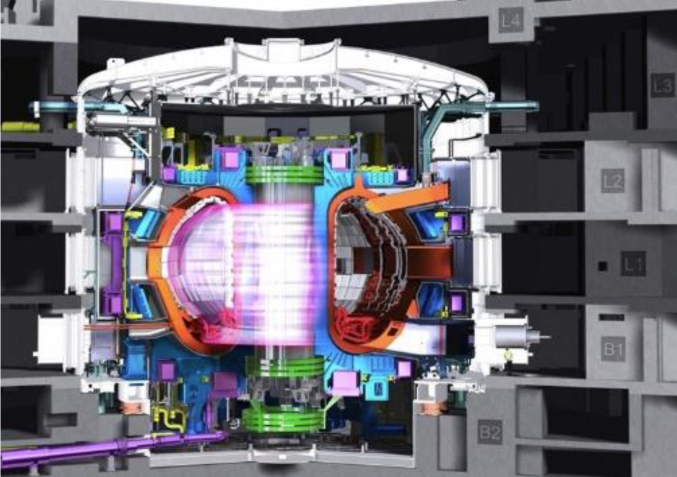

<b>Asztalos Örs</b>: Segédmunkatárs, a Magyar Nukleáris Társaság Fúziós Szakcsoportjának az elnöke

Az energiaigény növekedésével, és a fosszilis energiahordozók végességének tudatával az emberiség komoly kihívások elé néz energetikai téren. Az egyik lehetséges megoldás az úgynevezett magfúzió, az a folyamat, amellyel a csillagok termelik az energiát, így a mi Napunk is.
Immár 60 éve folynak a fúzió földi megvalósítását célzó kutatások, és az első, pozitív energiamérleget célzó kísérlet, az ITER, 2025-ben indul majd Franciaországban. Az előadásomban a magfúzió fizikai alapjainak áttekintése után bemutatom a fúziós kutatások útját a kezdetektől az ITER-ig, és rávilágítok azokra a hatalmas kihívásokra, amelyek még megoldásra várnak.

  
