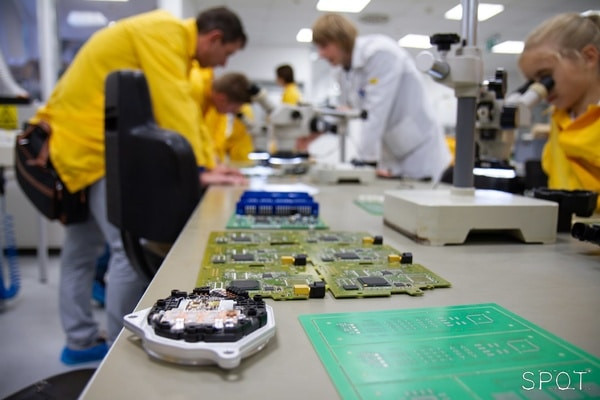

<b>Bátorfi Réka</b>: Az ETT tudományos segédmunkatársa, kutatási területei többek között az ón tűkristályok. Alkalmazott mérnöki tapasztalata a teljes elektronikai gyártás lépéssorozatára kiterjed. Réka a tanszék nagykövete az egyetem Lányok Napja programsorozatában.
  
<b>Havellant Gergő</b>: A BME Elektronikai Technológia Tanszékének specializációs hallgatója. Érdeklődési területei a mikrovezérlőkkel megvalósított komplett készülékek és mérőrendszerek; az elektronikai szereléstechnológiák. TDK kutatás keretében foglalkozott textil maszkok szűrőképességének vizsgálatával.

<b>Takács Gergő</b>: A BME Elektronikai Technolgóia Tanszék tanszéki mérnöke. Szakterülete az elektronikai gyártástechnológiák és a minőségi vizsgálatok.

Mindnyájan használjuk az életünket ellepő elektronikai kütyüket, mobiltelefonokat, elektronikai eszközöket. Ám azt csak kevesen tudják, hogy milyen összetett lépéssorozaton keresztül készülnek el az eszközök lelkét képező áramköri szerelvények. A program során bemutatásra kerül az elektronikai iparban széleskörűen használt felületszerelési technológia, az ehhez kapcsolódó technológiai lépések (pl. stencilnyomtatás) és berendezések. Az Elektronikai Technológia Tanszék laborkomplexumában az ipari megoldások és a kutatási lehetőségek ötvöződnek a megvalósítás szépségével.
  
 
