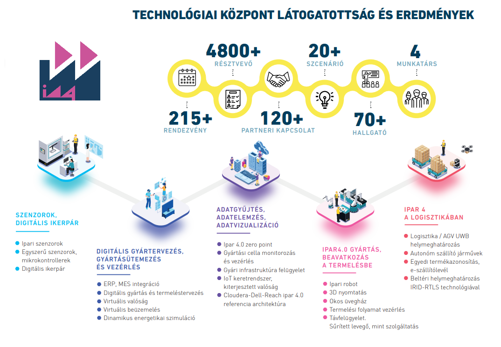

<a href="https://www.linkedin.com/in/l%C3%A1szl%C3%B3-kov%C3%A1cs-059089b/" target="_blank">Kovács László</a>: 
BME Ipar4.0 Technológiai Központ vezetője.
  
Csak akkor mennek a dolgok, ha Ön is ott van? Úgy érzi, csak újabb gépek vásárlásával lehet enyhíteni a vevői nyomáson? A vevők információéhsége minden nap extra munkával terheli? Korszerű üzleti modellel és ipar 4.0 technológiai megoldásokkal egyaránt felveheti a versenyt.
  
