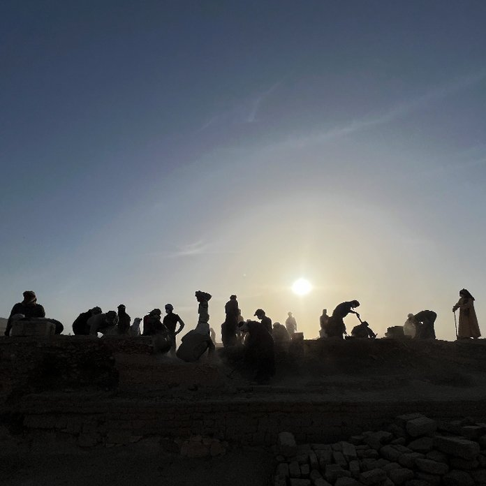

<b>Prof. Vasáros Zsolt DLA</b>: építész a BME Exploratív Építészeti Tanszék, és a HAMT (Hungarian Archaeological Mission in Thebes, South Khokha Project ELTE és BME Budapest) vezetője. egyetemi tanár. Az egyetemi oktatás mellett (<a href="http://www.explo.bme.hu" target="_blank">www.explo.bme.hu</a>) saját építészeti praxisában alkot (<a href="http://www.narmer.hu" target="_blank">www.narmer.hu</a>). Az egyetemi oktatást szervesen egészítik ki az általa vezetett, illetve aktív részvételével folytatott kutatások Egyiptomban és Szíriában.

Beszámoló az Exploratív Építészeti Tanszék aktuális egyiptomi helyszíni kutatásairól, fókuszálva a kutatási terület közel 4000 évet átfogó építészetére. A régészeti feltárások bemutatása mellett összefoglaljuk a szorosan kapcsolódó és a Tanszék által alapított Hassan Fathy Survey Mission eredményeit is.

  
