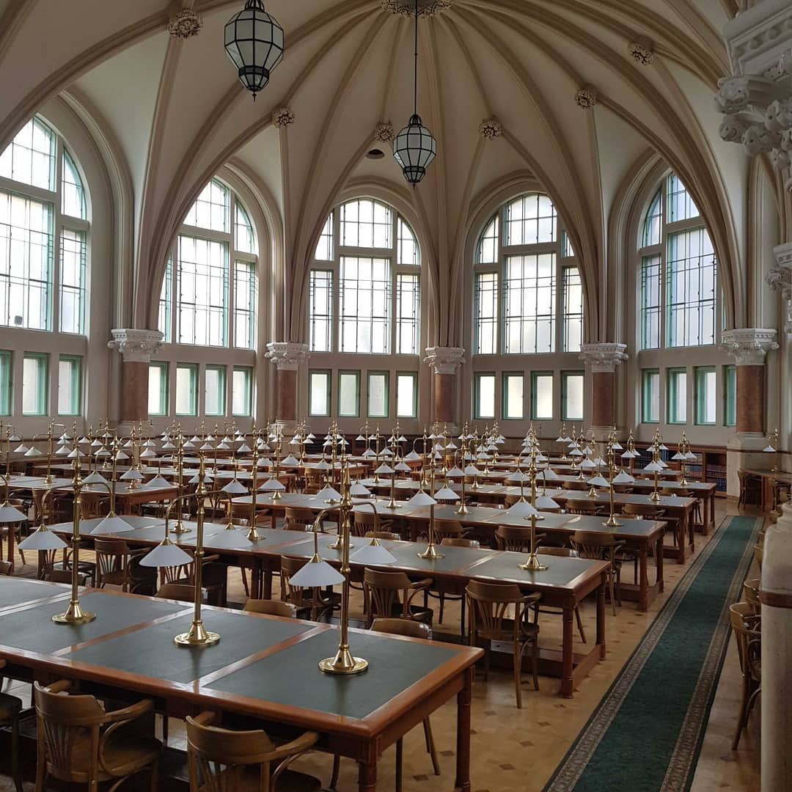

Az egyórás kincskeresés alatt a gyerekek játékos feladatokon keresztük járják be a könyvtár különböző területeit. A kalandos játékokat, kisebb csoportban oldják majd meg, amihez használniuk kell többek között a logikai, problémamegoldó és koncentrációs képességüket is.

  
