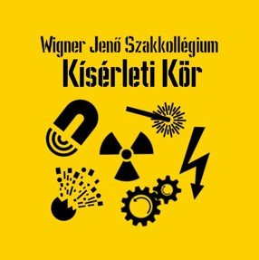

<a href="https://wjsz.ktk.bme.hu" target="_blank"> Dobos Kornél</a> 

Szabad szemmel látható radioaktivitás, szikrázó elektromosság, vízzel hajtott rakéta, kézzel fogható tűz és sok más érdekesség vár mindenkit a fizika világából.
Kicsiknek és nagyoknak egyaránt szólnak az érdekes fizikai kísérletek és érthető magyarázatok.

  

