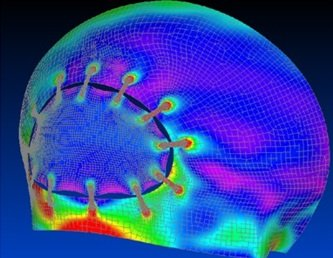

<b>Dr. Lovas László</b>: a BME Közlekedésmérnöki és Járműmérnöki Karán szerzett diplomát járműgépész szakirányon. PhD címét a gépjármű sebességváltók kapcsolhatósága témában szerezte. Jelenleg a BME Vasúti Járművek és Járműrendszeranalízis Tanszék docense. Több éve foglalkozik koponya implantátumok tervezésével.

Az orvosi gyakorlatban a koponya belsejének eléréséhez a csont egy részének eltávolítása szüksége, amelyet később pótolni kell. Az előadás röviden beszél a pótlás okairól, nehézségeiről, valamint a hiányzó rész modellezésének lehetőségeiről és a valós pótlás elkészítéséről, beépítéséről. 

  
