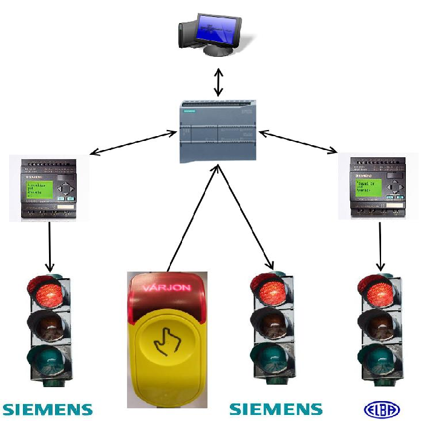

Közúti Közlekedésirányítási Laboratórium általános bemutatása: kik vagyunk, mivel foglalkozunk. A ZalaZONE autóipari tesztpályára fejlesztendő egyedi forgalomirányító berendezések bemutatása. Mobilapplikációval vezérelhető jelzőlámpa bemutatása

 
<b><a href="http://kjit.bme.hu/index.php/hu/tanszeki-munkatarsak/11-munkatarsak/379-varga-balazs" target="_blank"> dr. Varga Balázs</a></b> 
 
<b><a href="http://kjit.bme.hu/index.php/hu/tanszeki-munkatarsak/11-munkatarsak/517-ormandi-tamas" target="_blank"> Ormándi Tamás</a></b>

 
