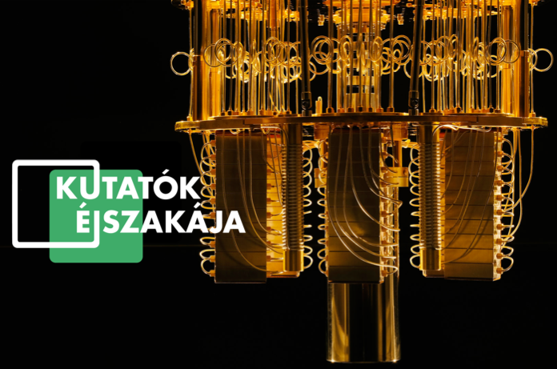

Programozzátok Ti is az IBM kvantumszámítógépeit! Rövid ismeretterjesztő előadás és játékos kvíz után a BME kutatói segítségével a résztvevők megtanulják programozni az IBM felhőn keresztül elérhető kvantumszámítógépeit. 

  
 

