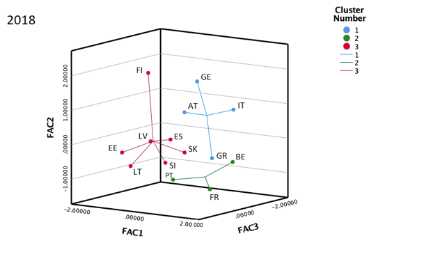

<a href="https://www.gtk.bme.hu/dr-novak-zsuzsanna/" about:_blank> Novák Zsuzsanna</a>: 2009-ben szerezte meg doktori fokozatát a Szent István Egyetem Gazdálkodás- és Szervezéstudományi Doktori Iskolájában. Doktori disszertációját A gazdasági konvergencia és a monetáris politika néhány összefüggése címmel készítette. 2014 és 2018 között a Magyar Nemzeti Bank elemzőjeként tevékenykedett.
2018 szeptembere óta a Budapesti Műszaki és Gazdaságtudományi Egyetem Pénzügyek Tanszékének docenseként tart pénzügyi témájú előadásokat. 
Főbb kutatási területei: monetáris politika, egyensúlyi árfolyamok, államadósság, valamint az innováció, termelékenység és foglalkoztatás összefüggésének vizsgálata.

 
Az előadás keretében egy mintegy két évet felölelő kutatás elméleti alapjaiba és főbb eredményeibe kap betekintést a hallgatóság. A kutatás áttekinti a likviditási csapda jelenségének elmélettörténeti alapjait, majd empirikus vizsgálatokon keresztül értékeli annak ténylegesen megfigyelhető gazdasági hatásait mindenekelőtt az euroövezet, de érintőlegesen az USA és Japán gazdaságának vizsgálata révén. A Kutatók Éjszakája keretében Tatay Tibor, Orlovits Zsanett és Novák Zsuzsanna a Risks folyóiratban megjelenés alatt álló, az euroövezeti gazdaságokat felölelő klaszterelemzésének eredményeiből is nyújt egy rövid ízelítőt rámutatva az eurozóna gazdaságainak pénzügyi sokszínűségére, eltérő vagyon szerkezetére.

  
