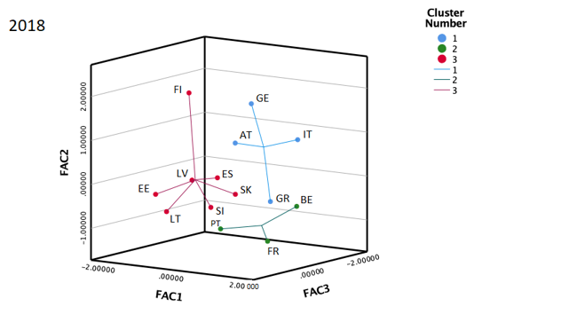

<a href="https://www.gtk.bme.hu/dr-novak-zsuzsanna/" target="_blank"> Zsuzsanna Novák</a>: The presenter obtained her doctoral degree at the Doctoral School of Management and Business Administration of the Szent István University, Gödöllő. The title of the dissertation is Some coherences between economic convergence and monetary policy. Between 2014 and 2018 she worked as analyst for the MNB (Central Bank of Hungary). She has been a lecturer of various financial subjects at the Department of Finance and Accounting of the Budapest University of Technology and Economics since September 2018. Her main field of research is: monetary policy, equilibrium exchange rates, public debt, analysis of the relationship between innovation, productivity and employment. 

Within the frames of the presentation the audience can get insight into the theoretical foundations and main results of a research project. The research provides an overview of the history of the liquidity trap phenomenon in economic theory, then it evaluates its actually observable economic effects through the example of the eurozone above all, but also touching on the economies of the USA and Japan as well. In the Researchers' Night Programme the presentation also gives a foretaste of the results of a cluster analysis encompassing eurzone economies included in a paper under publication in the Journal Risks, prepared under the coauthorship of Tibor Tatay, Zsanett Orlovits and  Zsuzsanna Novák pointing at the financial diversity and differing wealth structure of eurozone economies.

  

