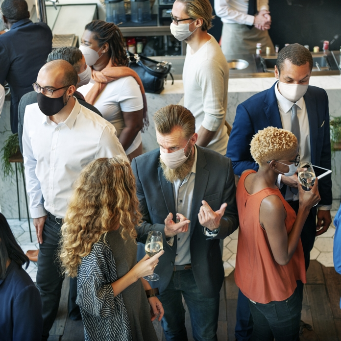

<b>Dr. Héder Mihály: </b> Okleveles mérnök-informatikusként végeztem a BME-n 2009-ben, a rendszerfejlesztés szakirányon. Ugyanebben az évben jelentkeztem a Tudományfilozófia és Tudománytörténet Doktori Iskolába. Informatikusként természetes nyelvek feldolgozásával, szemantikus annotációs technológiákkal és rendszerek tervezésével foglalkoztam a legtöbbet. Ezeken a területeken ma is aktív vagyok, részben saját kutatások, részben informatikus diplomázók témavezetése révén. Doktori kutatásaim zöme a mesterséges intelligencia filozófiájával kapcsolatos, ezen belül az emergens számítások és számítógépek lehetőségével, illetve a hallgatólagos tudással foglalkoztam mélyebben. Érdekel még Polányi Mihály filozófiája, továbbá a technikafilozófia, a mérnöki tudományok ismeretelmélete és impakt mechanizmusa.

<b>Dr. Bíró Gábor István: </b>igazgatásszervező (BA, Budapesti Corvinus Egyetem, 2010), Európai és nemzetközi közigazgatási szakértő (MA, Budapesti Corvinus Egyetem, 2012), Tanár - közgazdász tanár (MSc, Budapesti Corvinus Egyetem, 2013) és tudományfilozófiára és tudománytörténetre szakosodott filozófus (PhD, Budapest Műszaki és Gazdaságtudományi Egyetem, 2017). A Budapesti Műszaki és Gazdaságtudományi Egyetem Filozófia és Tudománytörténet Tanszékének egyetemi adjunktusa. Oktatási profiljába tartozik a társadalomtudományok filozófiája és a közgazdaságtan története és filozófiája. Monográfiája jelent meg The Economic Thought of Michael Polanyi (Routledge, 2019) címmel, szerkesztett kötete Humanity and Nature in Economic Thought (Routledge, 2021) címmel. Cikkeket jelentetett meg a Journal of the History of Economic Thought, a History of European Ideas, a Journal of Evolutionary Economics,a Tradition & Discovery: The Polanyi Society Periodical és a Polanyiana szakfolyóiratokban. Rendszeresen jelennek meg recenziói a History of European Ideas, a Metascience, a The Berlin Review of Books és az LSE Review of Books szaklapokban. 2016-ban elnyerte az Új Nemzeti Kiválóság Program (16-3) PhD hallgatóknak szóló ösztöndíját, 2017-ben az év doktorandusza lett a Filozófia tanszéken (BME-FTT), 2020-ban pedig a Kar kiváló kutatója junior kategóriában. 2021-ben elnyerte a legjobb közgazdaságtan-történeti cikkért járó Craufurd Goodwin díjat (History of Economics Society). Rendszeres meghívottja a Polányival foglalkozó nemzetközi konferenciáknak, könyvéről számos recenziót írtak magas presztízsű nemzetközi szakfolyóiratokban (Journal of the History of Economic Thought, European Journal of the History of Economic Thought, History of European Ideas, Metascience, Contemporary Sociology).

6,5 millió halott, 607 millió megbetegedés. 2019 decembere és 2022 szeptember 9 között ez a COVID-19 járvány globális mérlege. A járvány kitörését követően a vírusokkal (virológusok) és a vírusok terjedésével (epidemiológusok) kapcsolatos szakértelem - a téma aktualitása miatt - utat talált az állampolgárokhoz. Online és offline csatornákon is egyre többen és többet beszéltek arról, hogy hogyan segíthetik ezek a szakterületek a járvány elleni védekezést, arról, hogy mit és hogyan alkalmazhatunk ezen területek meglátásaiból annak érdekében, hogy megvédjük mások és magunk egészségét. Ugyanakkor rendkívül kevés szó esett az emberekkel - ebben az esetben a potenciális vírushordozókkal - kapcsolatos szakértelmek hasznosíthatóságáról, vagyis arról, hogy a pszichológia, a szociológia és más társadalomtudományok meglátásai hogyan segíthetik a járvány elleni védekezést. Különösen szembetűnő ez a hiányosság a legnézettebb magyar nyelvű hírszolgáltató és ismeretterjesztő műsorok esetében, melyek a pandémia elmúlt közel három évében talán egyetlen egy adást sem szenteltek annak, hogy társadalomtudós vendégekkel elemezzék az emberi viselkedést a járvány kontextusában. Rövid ismeretterjesztő előadásomban sajnos ennek a közel három éves elmaradásnak a bepótlására terjedelmi okok miatt nem vállalkozhatok. Arra viszont igen, hogy a COVID-19-el kapcsolatos legújabb nemzetközi szociálpszichológiai kutatásokat szemlézve, magyar nyelven először engedjek betekintést abba, hogy miért volna fontos nemcsak orvostudományi és rendészeti, de társadalomtudományi szakértelmet is igénybe venni a járványkezelésben.

 
  

