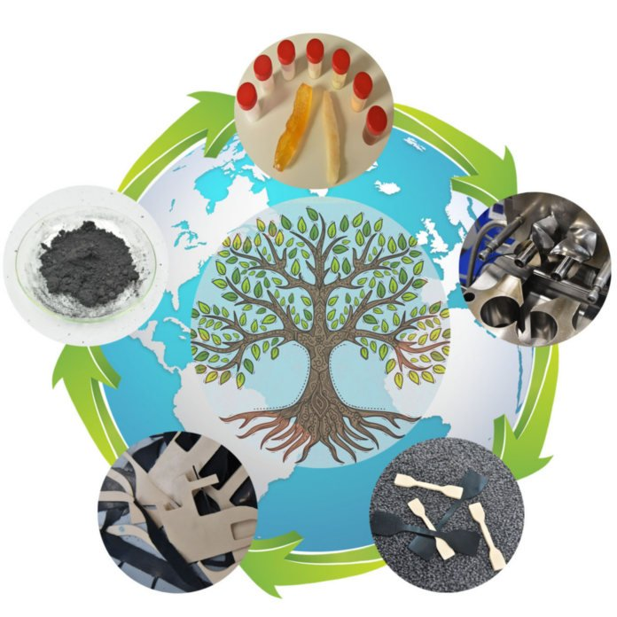

<a href="http://www.pt.bme.hu/munkatarsadatlap.php?id=25B9ug9m48B6A987r5q2343q99nw9rb7m3n3qwh2&l=m" target="_blank"> Dr. Tamás-Bényei Péter</a> 
<a href="http://www.pt.bme.hu/munkatarsadatlap.php?id=72s794mv2u2s4334p785un64x2xk2g6j2fhum2h5&l=m" target="_blank"> Kohári Andrea</a> 
<a href="http://www.pt.bme.hu/munkatarsadatlap.php?id=dB92xrjwf6g65fAuA583qk96esxj4xsrm6uz529g&l=m" target="_blank"> Simon Dávid Ábel</a> 
<a href="http://www.pt.bme.hu/munkatarsadatlap.php?id=826sp47qg4h22zewzB6m7r62r7tdsns73Ak8b4r4&l=m" target="_blank">  Pirityi Dávid Zoltán</a> 
<a href="http://www.pt.bme.hu/munkatarsadatlap.php?id=9t28uf5cvB26vv649pg8dgu327494ex4mxdp6v9u&l=m" target="_blank"> Varga László József</a> 
<a href="http://www.pt.bme.hu/munkatarsadatlap.php?id=m2u96285n263k69972655k9B37gmduggs44fnc47&l=m" target="_blank"> Dr. Czél Gergely</a> 
<a href="http://www.pt.bme.hu/munkatarsadatlap.php?id=8h6v84sgb4ft76gc23zBh5Aruux9w4B277eh9jhv&l=m" target="_blank"> Dr. Pomázi Ákos</a> 
<a href="http://www.pt.bme.hu/munkatarsadatlap.php?id=qj2v38xjBBe75ve8s8bA2ukv8zAf2j29ej44232t&l=m" target="_blank"> Sántha Péter</a> 
<a href="http://www.pt.bme.hu/munkatarsadatlap.php?id=725cAB3m2z29r2q38472d978Bz8u8n3uvh435758&l=m" target="_blank"> Nemes-Károly István</a> 
<a href="http://www.pt.bme.hu/munkatarsadatlap.php?id=7x3675Aez5z3f5gAtggAf72wj64zf334zu3A2r62&l=m" target="_blank"> Dr. Kmetty Ákos</a> 
<a href="http://www.pt.bme.hu/munkatarsadatlap.php?id=Btv9mv8qxj57f62x498x7on36j78d22e4683yf76&l=m" target="_blank"> Dr. Suplicz András</a> 
<a href="http://www.pt.bme.hu/munkatarsadatlap.php?id=Bjpon4ek5oe8zjb274q46e75BB86q59p3574dA8o&l=m" target="_blank"> Dr. Török Dániel</a> 
<a href="http://www.pt.bme.hu/munkatarsadatlap.php?id=j2j3e454q78eqxmsstuvb3639ho6B799bpp6kbh9&l=m" target="_blank"> Dr. Kovács Norbert Krisztián</a> 
<a href="http://www.pt.bme.hu/munkatarsadatlap.php?id=kb45kox2hu4xxz4jn8u627pwn3ok78975d9exw6c&l=m" target="_blank"> Dr. Gere Dániel</a>

A gumi alapú termékek az élet minden területén megtalálhatók, gondoljunk csak egy egyszerű befőttes gumira, vagy gépjármű abroncsra, de akár egy repülőgép, vagy űrhajó hajtóműrendszerében megtalálható tömítésre. Ezen anyagokat alapvetően nagy rugalmasság, jó rezgéscsillapító- és energiaelnyelő-képesség jellemzi, amely az alkotók minőségének és mennyiségének gondos megválasztásával egyedi igényre szabható. 

Az esemény során a látogatók megismerkedhetnek a gumikeverékek előállítási módszereivel, megtudhatják, hogy mit jelent a vulkanizáció, valamint megtapasztalhatják, hogy befolyásolja a hőmérséklet a gumik rugalmasságát. Emellett kitérünk a gumik anyagában történő újrahasznosítási lehetőségeire a körkörös gazdasági szemlélet tükrében. Mindezek mellett a látogató egy átfogó képet kaphat a műanyagiparban használatos anyagokról és eljárásokról is. A program kapcsolódik a Polimertechnika Tanszék T épületi laboratóriumában "Mikroszkóp-Mikroszál; kompozit erősítőanyagok és vizsgálatuk"  címmel megrendezésre kerülő programhoz és a hozzá kapcsolódó laborlátogatáshoz.

<b>Az egyes labortevékenységek bizonyos esetekben erősebb szag- és hanghatással járhatnak!</b>

  
