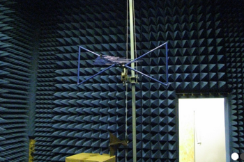

<b> Szűcs László:</b> BME HVT, tanszéki mérnök

Vajon egy műszálas pulóver okozhat veszélyt az autóban? 

Milyen követelményeknek kell megfelelni egy gépjármű elektronikájának az üzembiztos működéshez?

Milyen követelményeknek kell megfelelni egy gépjármű elektronikájának az üzembiztos működéshez? Vajon egy műszálas pulóver okozhat veszélyt az autóban? Az ilyen kérdésekre keresünk választ a bemutatón szereplő mérések segítségével. Az EMC mérőszoba (elektromágneses süketszoba) bemutatása.
  
 

