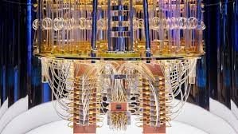

<b>Dr. Asbóth János</b>: a BME Elméleti Fizika Tanszékének docense és a Wigner FK Kvantumoptikai és Kvantuminformatikai Osztályának tudományos főmunkatársa, a kvantumos szilárdtestfizika és a kvantuminformáció-elmélet határán végzi kutatásait.

Mi az a kvantumszámítógép, mikor lesz ilyen, mire lesz jó? Milyen prototípusokat épít a Google, az IBM, és más cégek, hogyan lehet ezeket a gépeket kipróbálni?  És milyen kapcsolódó kutatás folyik ma a BME Fizikai Intézetében? 

  
