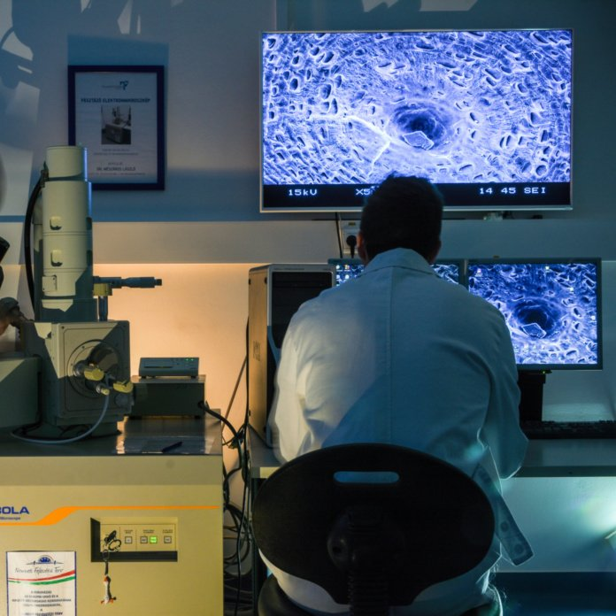

<a href="http://www.pt.bme.hu/munkatarsadatlap.php?id=25B9ug9m48B6A987r5q2343q99nw9rb7m3n3qwh2&l=m " target="_blank"> Dr. Tamás-Bényei Péter</a>: 2012 óta dolgozik a Budapesti Műszaki és Gazdaságtudományi Egyetem, Gépészmérnöki Karának Polimertechnika Tanszékén, 2014-től adjunktusként, emellett 2012 óta a MTA-BME Kompozittechnológiai Kutatócsoport tudományos munkatársaként. Kutatási területe a szálerősített kompozitok anyagok és gyártástechnológiák fejlesztése, valamint a polimer kompozitok jellemzőinek vizsgálata. Emellett elasztomerek fejlesztésével és viselkedésük elemzésével is foglalkozik. Részt vesz több ipari K+F fejlesztési projektben is. Nős, 3 gyermek édesapja.

<a href="http://www.pt.bme.hu/munkatarsadatlap.php?id=62kg49hu387647td29786bpccxc96c35466338Bo&l=m" target="_blank"> Dr. Morlin Bálint</a> 

<b>Pinke Balázs</b>: TANSZÉKI MÉRNÖK, MIKROSZKÓPIA ÉS MORFOLÓGIA SZAKLABORATÓRIUM VEZETŐ

A nagyteljesítményű mérnöki anyagoknak a szálerősített polimer kompozitok napjainkban már tetemes részét teszik ki. A kompozitokban a szilárdságért felelős erősítőanyagot - amely jellemzően szál formájú - szívós mátrixanyag foglalja magába. A hajszálnál kisebb átmérőjű elemi szálak a mátrixszal együttműködve adják a kompozitok fajlagosan a fémeknél is nagyobb szilárdságát. Az esemény során a látogatók megtapasztalhatják, hogy ezek a mesterséges szálak milyen erősek önmagukban összehasonlítva egy természetes szállal, valamint betekintést nyerhetnek a mikroszkópia világába is egy több ezerszeres nagyításra is képes elektronmikroszkóp bemutatásán keresztül. A program kapcsolódik a Polimertechnika Tanszék MT épületi laboratóriumában "Mi lesz, ha már nem lesz? Gumitermékek előállítási lehetőségei a körkörös gazdasági szemlélet jegyében"  címmel megrendezésre kerülő programhoz és a hozzá kapcsolódó laborlátogatáshoz.

  

