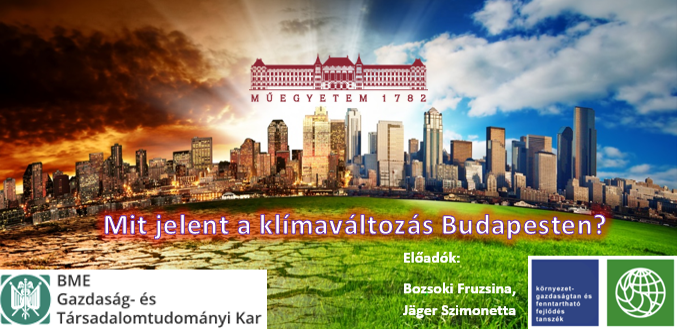

<b>Bozsoki Fruzsina:</b> (PhD hallgató, Környezetgazdaságtan és Fenntartható Fejlődés Tanszék), A BME-VBK környezetmérnök alapszak elvégzése után a regionális és környezeti gazdaságtan mesterszakon folytattam tanulmányaimat. Miután megszereztem mesterdiplomámat, megkezdtem PhD tanulmányaimat. Jelenleg másodéves vagyok a BME Környezetgazdaságtan és Fenntartható Fejlődés Tanszékén, kutatási témám a barnamezős területek revitalizációs megoldásainak vizsgálata fenntarthatósági szempontból, továbbá ehhez kacsolódóan a városi élhetőség vizsgálata.

<b>Jäger Szimonetta:</b> (PhD hallgató, Környezetgazdaságtan és Fenntartható Fejlődés Tanszék): A BME-GTK nemzetközi gazdálkodás alapszak elvégzése után a regionális és környezeti gazdaságtan mesterszakon folytattam tanulmányaimat. Miután megszereztem mesterdiplomámat, megkezdtem PhD tanulmányaimat. Jelenleg harmadéves vagyok a BME Környezetgazdaságtan és Fenntartható Fejlődés Tanszékén, kutatási témám a városi átalakulások elemzése a fenntarthatóság és klíma-alkalmazkodás kapcsolatrendszerében.

A 2022-es nyár volt eddig a legmelegebb! De miért?
A klímaváltozás mára életünk részévé vált, meghatározza a mindennapi döntéseinket, ha nem is tudunk róla. Bizonyára ezt te is érzed a bőrödön! De mit tehetünk mi emberek, főleg mi, városlakók?
Ha érdekelnek a miértek és kíváncsi vagy a megoldásokra, látogass el előadásunkra!
  
 