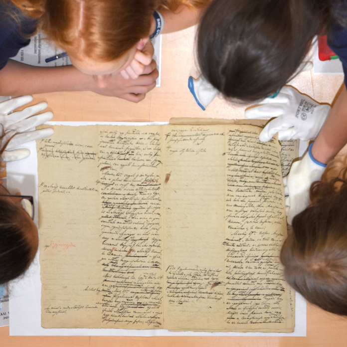

<b>Batalka Krisztina, Horváth Attila Levente</b>: Levéltáros és történész: e két szakma művelői mozognak otthonosan a levéltári iratok között, ők teszik lehetővé, hogy azokat mások is használhassák, bemutatásuk pedig élményt adhasson számukra. 

 
Az idén 240 éves Műegyetem múltját a BME OMIKK Levéltár őrzi: régi dokumentumokat, fotókat, érdekességeket. A levéltári raktárba csak kevesen léphetnek be, a Kutatók Éjszakáján azonban lehetőség nyílik elmerülni a történelemben.

  
