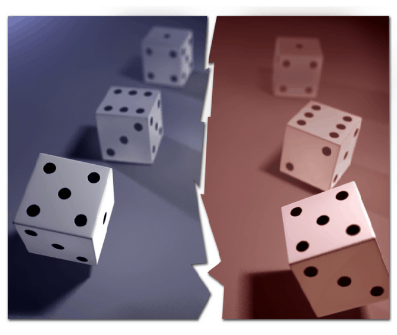

<b>Weiner Mihály:</b> fizikus és matematikus. Legfőbb kutatási területe a kvantumfizika információelméleti következményeinek vizsgálata és rangos nemzetközi tudományos folyóiratokban jelentek meg eredményei. Nagy Britanniában érettségizett, évekig Olaszországban élt, Japántól Ausztriáig számtalan helyen volt vendégkutató. Most a BME docense, aki egyéb kutatási és oktatási feladatai mellett a BME évenkénti összegyetemi matematika versenyének a szervezője is. Szabadidejében szeret hegedülni és rendszeres föllépője az évenkénti "matematikus hangverseny" -nek.   

"Alice és Bob gyanúsan sokat nyertek. Csaltak, titokban üzenetet váltottak? Nem, hisz olyan messze voltak, hogy a játék alatt még a fény sem ért volna át.." Egy közönséget is játékba vonó előadás a kvantumos összefonódás információelméleti következményeiről.

  
 