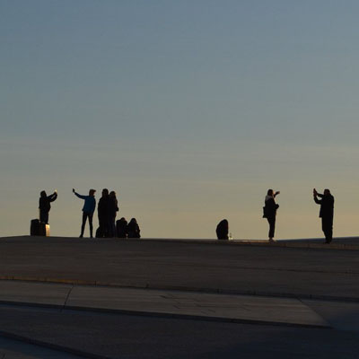

<b>Barna Emília</b>: PhD, szociológus és a populáriszene-kutató, a BME Szociológia és Kommunikáció Tanszékének docense, a Kulturális iparágak MA specializáció vezetője. Főbb kutatási témái közé tartozik a zeneipar és a digitalizáció, a zeneipar genderviszonyainak vizsgálata, a kulturális munka, a zene és a politika kapcsolata. Tófalvy Tamással együtt szerkesztője a Made in Hungary: Studies in Popular Music (Routledge, 2017) és a Popular Music, Technology and the Changing Media Ecosystem: From Cassettes to Stream (Palgrave, 2020) című köteteknek. Tanulmányai többek között a First Monday, a Popular Music & Society és a Popular Music c. folyóiratokban jelentek meg. A Helyzet Műhely tagja.

<b>Blaskó Ágnes</b>: szociodráma-vezető, kutató, a BME GTK Szociológia- és Kommunikáció Tanszékén oktató. A legkülönbözőbb társadalmi csoportokkal dolgozik együtt: elnyomottakkal és privilegizáltakkal. A szociodráma módszer fejlesztője, elkötelezett a szociodráma kutatási módszerként való alkalmazásának szélesebb körben való bevezetésében is. A Táguló realitás című első magyar nyelvű szociodráma könyv főszerkesztője. 

<b>Horváth Máté</b>: a BME GTK Kommunikáció- és médiatudomány szakán hallgató. BSc-diplomáját az ELTE ÁJK Politikatudományok képzésén szerezte. Érdeklődik a kultúra szociológiája, valamint a zene politikai, gazdasági és társadalmi aspektusai iránt. Az f21.hu kulturális magazin szerkesztője, újságírója.

A hangok gyakran a zeneiparban is bennakadnak: a strukturális elnyomás hallhatatlanná, láthatatlanná tesz olyan szereplőket, akiknek a munkája nélkülözhetetlen az iparágban. Őrlődésük – noha kényelmes magánügynek tekinteni – valójában társadalmi ügy. Eredménye az iparág működésének, a genderviszonyoknak, amelyeket a kulturálisan rögzült kommunkációs stratégiák is folyvást megerősítenek. A kutatók éjszakáján egy konkrét, a zeneipari dolgozók számára mindennapi jelenetet mutatunk be, amit szociodramatikus adatgyűjtésünk segítségével hoztunk felszínre. Workshopunkon még a színpadon tetten érjük az érzelmi munka működését és jelentőségét, közösen megértjük az elnyomó kommunikációs stratégiákat; majd ránézünk arra, hogy mindez hogyan következik a zeneipar működéséből, a tágabb társadalmi kontextusból.
  

