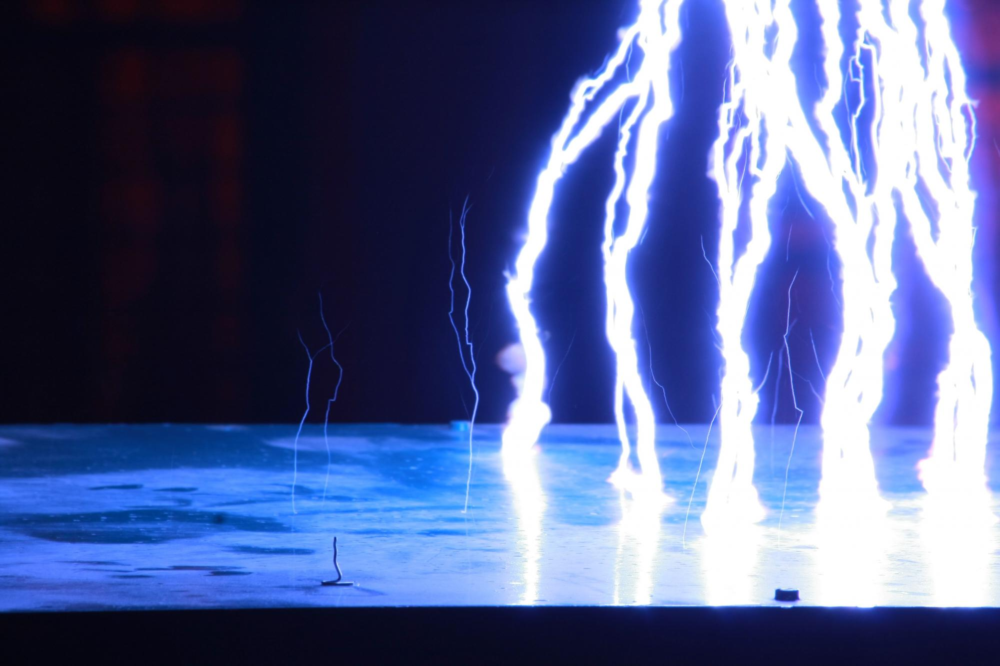

Milyen hatása van a nagyfeszültségű berendezéseknek és az azok által létrehozott tereknek mindennapjainkra? Hogyan viselkednek a növények, egyes mesterséges tereptárgyak az őket érő villámcsapás esetén? Mit tegyünk, ha a zivatar nyílt terepen ér bennünket? Milyen jellegzetességei vannak a nagyfeszültségen égő villamos ívnek? Milyen veszélyei vannak a gyakorlatban az elektrosztatikus feltöltődésnek? Bemutatónkon testközelből nyílik lehetőség a különböző nagyfeszültségen lejátszódó jelenségek megtekintésére, valamint azok jellegzetességeinek megismerésére. A hozzánk ellátogatóktól karnyújtásnyira elvégzett látványos kísérletek segítségével igyekszünk mindenkihez közelebb hozni a villamos energetika területén alkalmazott berendezéseket és technikákat. Bemutatjuk, hogyan lehetséges biztonságosan munkát végezni egy feszültség alatt álló távvezetéken. Valódi távvezetékoszlopon mutatjuk be, milyen veszélyeket rejthet a távvezeték a madarak számára és hogyan működnek a madárvédelmi eszközök. A látogatók megtudhatják azt is, hogy a madarak mozgása, fészkelési és táplálkozási szokásai milyen veszélyeket jelenthetnek a távvezeték üzemének szempontjából. Modellezzük a villámcsapást és annak hatásait, láthatóvá tesszük a nagyfeszültségű eszközök környezetében létrejövő villamos teret. A különböző módokon létrehozott nagyfeszültségű ív segítségével változatos példákon keresztül nyílik lehetőség a villamosmérnöki tudomány ezen ágának megismerésére. A Budapesti Műszaki és Gazdaságtudományi Egyetem Nagyfeszültségű Laboratóriumába ellátogatók biztonságos körülmények között, testközelből láthatnak és érthetnek meg olyan, elsősorban nagyfeszültségen lejátszódó veszélyes jelenségeket, amelyekre a mindennapi tevékenységük során általában nincs lehetőség. További információ:<a href ="http://nfl.vet.bme.hu/" target="_blank">http://nfl.vet.bme.hu/</a>

  
 

