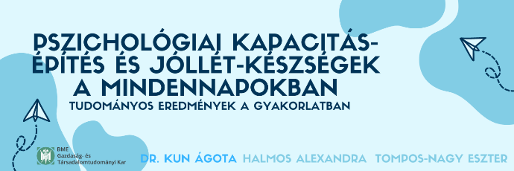

<a href="https://www.researchgate.net/profile/Agota-Kun" target="_blank"> Dr. Kun Ágota</a>: 2008 óta a BME Ergonómia és Pszichológia Tanszék oktatója, kutatója. Jelenleg a pszichológia mesterszak munka- és szervezetpszichológia specializáció felelőse, egyetemi adjunktus. Fő kutatási területe a munkahelyi jóllét és a pozitív pszichológia gyakorlati alkalmazása.

<a href="https://www.linkedin.com/in/eszter-tompos-nagy-72589067/" target="_blank"> Tompos-Nagy Eszter</a>: kutatási területe a kiégés és a kiégés prevenciója.

<a href="https://www.linkedin.com/in/alexandra-halmos-4927b999/" target="_blank"> Halmos Alexandra</a>: kutatási területe a munkahelyi jóllét és hatékonyság agilis szervezeteknél.

 
Az utóbbi két és fél év igazán próbára tett bennünket - a megszokott, jól működő, eredményes és bevált eszközeink nem feltétlenül voltak elegendőek és megfelelőek ahhoz, hogy megtartsuk a pszichés egyensúlyi állapotunkat. A jó hír az, hogy számtalan olyan, belső erőforrás tényezővel rendelkezünk egyébként, amelyek fejleszthetők, erősíthetők, s amelyek segíthetnek bennünket abban, hogy a megterhelő, nehéz helyzetekben is megtartsuk mentális egészségünket és jóllét-érzetünket. Hogyan küzdhetsz meg a saját gondolkodási csapdáiddal? Hogyan őrizd meg a hatékonyságodat? Hogyan maradhatsz reményteli vagy éppen optimista? Különböző gyakorlatok mentén megnézzük, hogyan tudod ezentúl sokkal tudatosabban a saját kapacitásaidat erősíteni, újratölteni vagy akár fejleszteni.

  
 
